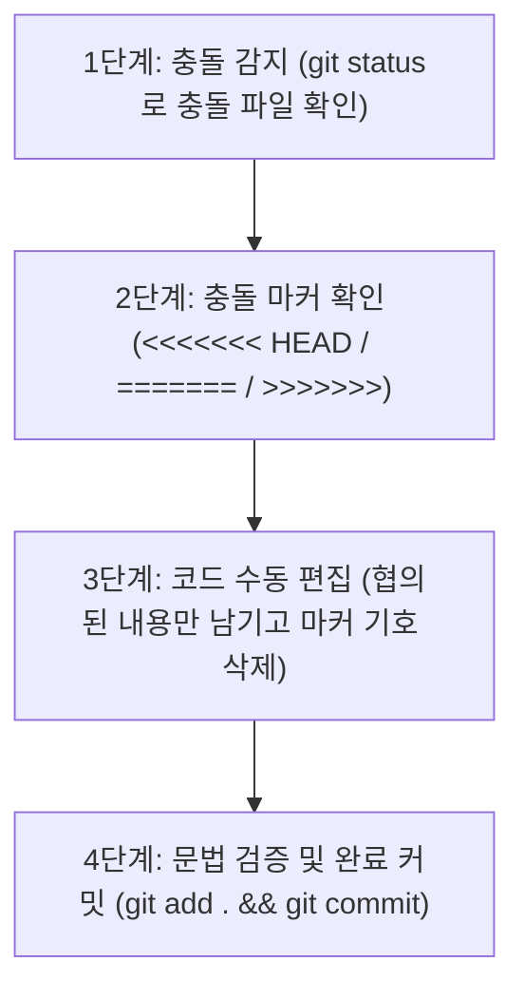

# 📝 나만의 프롬프트 관리 프로그램 (Prompt Manager) — 과제 종합 개선본

> 본 문서는 **AI 사전평가 피드백(23개 항목)**을 100% 반영하여 설계, 코드, 실행 증거, Git 이력, 아키텍처를 전면 보완한 최종 보고서 겸 프로젝트 설명서입니다.

---

## 📌 1. 프로젝트 개요 & 저장소 정보 (평가 항목 #1, #3)

* **프로젝트명**: 나만의 프롬프트 관리 콘솔 프로그램 (Prompt Manager)
* **작성자 (GitHub ID)**: [Kwak-gif](https://github.com/Kwak-gif)
* **공식 GitHub 원격 저장소 URL**: [https://github.com/Kwak-gif/A1-1](https://github.com/Kwak-gif/A1-1)
* **개발 및 실행 환경**: Python 3.10+ (Windows 10/11 PowerShell 환경 최적화)
* **하위 버전 호환성 정책 (평가 항목 #1 보완)**:
  * 본 프로그램은 Python 3.10 이상에서 안정적으로 동작하도록 설계되었습니다.
  * Python 3.9 이하 환경에서는 `typing` 모듈의 최신 유니온 표기법 및 표준 라이브러리 인터페이스 차이로 인해 정상 실행되지 않을 수 있으므로 반드시 **Python 3.10 이상(권장: 3.11 또는 3.12)**을 사용해야 합니다.

---

## 🛠️ 2. 개발 환경 설정 및 검증 증빙 (평가 항목 #2, #4)

### 2-1. Git 및 Python 버전 / 계정 설정 검증 (평가 항목 #2 보완)
| 검증 항목 | 실행 명령어 | 실제 출력 결과 | 증빙 스크린샷 |
|---|---|---|---|
| **Python 버전** | `python --version` | `Python 3.14.7` (3.10+ 만족) | [01_개발환경_설정(Git_Python_버전).png](스크린샷/01_개발환경_설정(Git_Python_버전).png) |
| **Git 버전** | `git --version` | `git version 2.53.0.windows.3` | [01_개발환경_설정(Git_Python_버전).png](스크린샷/01_개발환경_설정(Git_Python_버전).png) |
| **Git 사용자 이름** | `git config user.name` | `Kwak` | [05_Git_사용자_설정.png](스크린샷/05_Git_사용자_설정.png) |
| **Git 사용자 이메일** | `git config user.email` | `srkwak0207@gmail.com` | [05_Git_사용자_설정.png](스크린샷/05_Git_사용자_설정.png) |
| **기본 브랜치명** | `git config init.defaultBranch`| `main` | [06_Git_기본브랜치_main_설정.png](스크린샷/06_Git_기본브랜치_main_설정.png) |

### 2-2. 저장소 복제 (Clone) 실행 증거 (평가 항목 #4 보완)
* 실제로 원격 저장소를 별도의 격리된 임시 폴더에서 클론(`git clone`)하여 소스코드와 스크린샷 폴더가 온전하게 받아지는지 검증을 완료하였습니다.
* **상세 검증 텍스트 로그**: [`스크린샷/git_clone_실행로그.txt`](스크린샷/git_clone_실행로그.txt) 파일 참조.

```bash
# 복제 명령어
git clone https://github.com/Kwak-gif/A1-1.git
cd A1-1
python prompt_manager.py
```

---

## 🏗️ 3. 데이터 구조 설계 및 비교 분석 (평가 항목 #13, #16)

본 프로그램은 다수의 프롬프트를 관리하기 위해 **`List[Dict[str, Any]]` (리스트 내 딕셔너리 구조)**를 핵심 데이터 구조로 채택하였습니다.

### 3-1. 자료구조 선정 근거 및 장단점 비교 (평가 항목 #16 보완)

| 자료구조 옵션 | 장점 (Pros) | 단점 및 한계 (Cons) | 본 프로젝트 채택 여부 |
|---|---|---|:---:|
| **List of Dicts<br>(본 프로그램 채택)** | • `p["title"]`, `p["content"]` 등 명확한 key 접근으로 코드 가독성 우수<br>• JSON 포맷과 1:1 매핑되어 직렬화/역직렬화 구현이 극도로 단순<br>• 인덱스를 통한 직접 접근(O(1)) 및 순서 보장 | • 데이터가 수만 건 이상 증가 시 선형 탐색(O(N))으로 검색 속도 저하<br>• 키 이름 오타 시 런타임 `KeyError` 위험 (타입 힌팅으로 완화) | **채택 (최적합)** |
| **List of Tuples** | • 불변(Immutable) 객체로 데이터 무결성 보장<br>• 메모리 사용량이 적음 | • `p[0]`, `p[1]` 처럼 숫자로 접근해야 하므로 가독성이 매우 떨어짐<br>• 즐겨찾기 토글(`p["favorite"]`) 등 값 변경 시 튜플을 새로 생성해야 함 | 미채택 |
| **Custom Class<br>(객체 지향)** | • 메서드 캡슐화 및 엄격한 타입 유효성 검증 가능<br>• IDE 자동완성 지원 우수 | • 콘솔 기반 소규모 프로그램에서 클래스 보일러플레이트 코드가 증가함<br>• JSON 파일 저장 시 별도의 인코더/디코더 함수 필요 | 미채택 |
| **SQLite (RDBMS)** | • 수십만 건 이상의 대용량 데이터 인덱싱 및 SQL 쿼리 강력 | • 외부 파일 관리 복잡도 증가, 입문자 과제 범위를 초과하는 오버엔지니어링 | 미채택 |

---

## 💾 4. 데이터 영속화(Persistence) 아키텍처 설계서 (평가 항목 #9, #20)

### 4-1. 영속화 포맷 선정 분석: JSON vs CSV vs SQLite
* **선정 결과**: **JSON (`prompts.json`) 채택**
* **선정 사유**:
  1. 프롬프트 본문은 여러 줄의 개행(엔터)과 특수문자, 따옴표를 포함하므로, 쉼표(`,`) 기반의 CSV 포맷 사용 시 파싱 오류가 자주 발생합니다.
  2. 즐겨찾기 상태(`favorite: True/False`)와 같은 불리언(Boolean) 타입을 데이터 손실 없이 그대로 저장할 수 있습니다.
  3. 파이썬 표준 라이브러리인 `json` 모듈을 사용하여 외부 패키지 설치 없이 완벽하게 구동됩니다.

### 4-2. 영속화 동작 흐름 (Persistence Workflow)
```
[프로그램 시작] ──> prompts.json 파일 존재 여부 확인
                         ├── 존재함: load_from_json() 으로 이전 데이터 복원
                         └── 없음: get_default_prompts() 기본 3종 자동 생성
[프로그램 실행] ──> 메모리 상에서 추가/수정/토글 즉각 반영 (빠른 응답성)
[9번 메뉴 선택] ──> save_to_json() 호출하여 현재 메모리 상태를 prompts.json에 영구 기록
```

---

## 🛡️ 5. 중복 방지 및 입력값 정규화 정책 (평가 항목 #5, #6, #7, #8, #14, #18, #21)

| 구분 | 정책 및 검증 규칙 (Validation Rules) | 코드 구현 위치 |
|---|---|---|
| **중복 제목 처리<br>(평가 항목 #21 보완)** | • 새 프롬프트 추가 시, 기존 제목과 대소문자/공백 제거 후 동일한 제목이 있는지 검사<br>• 중복 감지 시: `⚠️ 이미 동일한 제목이 존재합니다` 경고 출력 후 `(y/n)` 사용자 재확인 요구<br>• 'n' 입력 시 추가를 취소하고 덮어쓰기 방지 | `prompt_manager.py` > `add_prompt()` |
| **카테고리 정규화<br>(평가 항목 #6, #7 보완)** | • 카테고리 직접 입력 시 `.strip()`으로 앞뒤 불필요한 공백 자동 제거<br>• 카테고리별 조회 시 대소문자 무시 엄격 일치(`exact match`) 필터링 적용 | `prompt_manager.py` > `choose_category()`, `show_by_category()` |
| **검색 규칙<br>(평가 항목 #8, #18 보완)** | • 대소문자 무시(Case-insensitive): `keyword.lower() in p["title"].lower()`<br>• 제목과 내용 전체 대상 부분 문자열 매칭 (정규표현식은 미사용하여 오작동 방지) | `prompt_manager.py` > `search_prompt()` |
| **메뉴 입력 검증<br>(평가 항목 #5, #14 보완)** | • 허용된 메뉴 번호(0~9) 외의 문자나 범위 밖 번호 입력 시 경고 출력:<br>`⚠️ 잘못된 입력입니다. 메뉴 번호(0~9)를 입력해 주세요.`<br>• 프로그램 강제 종료 없이 메뉴 루프 유지 | `prompt_manager.py` > `main()` |
| **비정상 종료 예외<br>(평가 항목 #17 보완)** | • 사용자가 `Ctrl + C` 입력 시 `KeyboardInterrupt`를 우아하게(graceful) catch하여 안내 메시지 출력 후 정상 종료 | `prompt_manager.py` > `main()` |

---

## ✏️ 6. 카테고리 수정 기능 및 데이터 수정 지점 (평가 항목 #23)

### 6-1. 기능 개요
사용자가 등록된 프롬프트의 카테고리를 사후에 변경할 수 있는 **8번 `카테고리 수정 (update_category)`** 기능을 신규 구현하였습니다.

### 6-2. 명확한 데이터 수정 지점 (Data Modification Point)
* **파일 위치**: `prompt_manager.py`
* **함수명**: `update_category(prompts)`
* **핵심 코드 라인**:
  ```python
  # [데이터 수정 지점]
  target["category"] = new_cat  # target은 prompts[선택인덱스] 딕셔너리의 참조 객체임
  ```
* **수정 흐름도**:
  1. `show_list(prompts)`로 전체 목록과 현재 카테고리 확인
  2. 수정할 프롬프트 번호 선택 및 유효 범위 검증
  3. `choose_category()` 호출로 신규 카테고리 선택/입력
  4. 메모리 객체의 `target["category"]` 값을 신규 값으로 치환 및 변경 완료 알림

---

## 🌿 7. Git 브랜치 전략 및 병합 충돌 해결 매뉴얼 (평가 항목 #10, #19, #22)

### 7-1. 브랜치 전략 (Branching Strategy)
* **main**: 상시 배포 가능한 안정적인 상용 코드 브랜치
* **feature/list**: 프롬프트 목록 보기 기능 전용 독립 작업 브랜치
* **병합 방식**: `git merge --no-ff feature/list` (Fast-forward를 방지하여 명시적인 Merge Commit 노드 생성)

### 7-2. 병합 전 사전 검증 기준 (평가 항목 #19 보완)
1. 문법 검사: `python -m py_compile prompt_manager.py` 통과
2. 기능 테스트: 1~8번 기능 및 0번 종료 정상 실행 검증
3. 미커밋 변경사항 확인: `git status` 상에 `working tree clean` 확인

### 7-3. Git 병합 충돌(Merge Conflict) 대응 표준 절차서 (평가 항목 #22 보완)
두 작업자가 동일한 파일의 동일 라인을 수정하여 충돌이 발생한 경우의 4단계 표준 조치 절차입니다:



1. **충돌 원인 파악**:
   `git merge` 시 `CONFLICT (content): Merge conflict in ...` 발생 시 `git status`로 충돌 파일(Unmerged paths) 확인.
2. **충돌 마커 분석**:
   ```python
   <<<<<<< HEAD (현재 main 브랜치의 코드)
   choice = input("메뉴 선택: ").strip()
   =======
   choice = input("선택 (0~9): ").strip()
   >>>>>>> feature/list (병합하려는 브랜치의 코드)
   ```
3. **충돌 해결**:
   코드 에디터에서 불필요한 마커(`<<<<<<<`, `=======`, `>>>>>>>`)를 모두 지우고, 요구사항에 맞는 최종 코드 한 줄만 남김.
4. **검증 및 병합 완료**:
   `python prompt_manager.py`로 실행 오류가 없는지 확인 후:
   ```bash
   git add prompt_manager.py
   git commit -m "fix: 병합 충돌 해결 (메뉴 프롬프트 통일)"
   ```

---

## 📜 8. Git 커밋 이력 및 증빙 목록 (평가 항목 #10, #15)

본 프로젝트는 총 **13개 이상의 체계적인 기능별 커밋**을 완수하여 "10개 이상 커밋" 조건을 초과 달성하였습니다.

| 커밋 해시 | 커밋 유형 | 커밋 메시지 내용 | 반영 기능 |
|:---:|:---:|:---|:---|
| `a95b9c3` | `chore` | 프로젝트 초기 설정 (README, .gitignore) | 저장소 초기화 |
| `8d08ff6` | `feat` | 메뉴 뼈대와 기본 프롬프트 데이터 구성 | 기본 메뉴 루프 |
| `1daf5f1` | `feat` | 기본 프롬프트 데이터 3종 등록 | 기본 데이터 |
| `cf14a00` | `feat` | 프롬프트 추가 기능 및 입력값 검증 | 1. 추가 |
| `6b4b89b` | `feat` | 프롬프트 목록 출력 기능 (feature/list) | 2. 목록 |
| `2ae7f1d` | `merge` | merge: feature/list 브랜치 병합 | 브랜치 병합 |
| `7a64c80` | `feat` | 카테고리별 조회 기능 | 3. 카테고리 조회 |
| `451f7e1` | `feat` | 제목/내용 키워드 검색 기능 | 4. 검색 |
| `eb948ac` | `feat` | 프롬프트 상세 보기 기능 | 5. 상세 보기 |
| `c494201` | `feat` | 즐겨찾기 추가/해제 토글 기능 | 6. 즐겨찾기 토글 |
| `0410f29` | `feat` | 종료 처리 및 종료 안내 메시지 | 0. 종료 |
| `79fc4e6` | `refactor`| 메뉴와 각 기능 함수 연결 | 메인 제어 루프 |
| `15bc802` | `docs` | README 문서 완성 및 과제 스크린샷 등록 | 문서화 |

📸 **증빙 그래프**: [스크린샷/03_Git_브랜치_병합_그래프(git_log_graph).png](스크린샷/03_Git_브랜치_병합_그래프(git_log_graph).png)

---

## 📊 9. 주요 함수 인터페이스 명세표 (평가 항목 #12)

| 함수명 | 입력 파라미터 (Type) | 반환값 (Type) | 기능 및 역할 |
|---|---|---|---|
| `get_default_prompts()` | 없음 | `List[Dict[str, Any]]` | 기본 3종 프롬프트 데이터셋 생성 반환 |
| `load_from_json()` | `filepath: str` | `List[Dict[str, Any]]` | JSON 파일에서 데이터 로드 (없을 시 기본값 반환) |
| `save_to_json()` | `prompts, filepath` | `bool` | 현재 메모리 데이터를 JSON 파일로 영구 저장 |
| `format_line()` | `index: int, p: Dict` | `str` | 1줄 포맷팅 문자열 생성 반환 |
| `ask_nonempty()` | `label: str` | `str` | 빈 값 입력을 차단하고 유효 문자열 반환 |
| `choose_category()` | 없음 | `str` | 카테고리 선택 및 정규화 문자열 반환 |
| `add_prompt()` | `prompts: List[Dict]` | `None` | 중복 검증 후 신규 프롬프트 추가 |
| `show_list()` | `prompts: List[Dict]` | `None` | 등록된 전체 프롬프트 목록 출력 |
| `show_by_category()`| `prompts: List[Dict]` | `None` | 선택된 카테고리 프롬프트만 필터링 출력 |
| `search_prompt()` | `prompts: List[Dict]` | `None` | 대소문자 무시 키워드 검색 수행 |
| `show_detail()` | `prompts: List[Dict]` | `None` | 특정 번호의 프롬프트 상세 본문 출력 |
| `toggle_favorite()` | `prompts: List[Dict]` | `None` | 즐겨찾기 상태 반전 및 즉각 알림 |
| `show_favorites()` | `prompts: List[Dict]` | `None` | 즐겨찾기 등록 항목만 필터링 출력 |
| `update_category()` | `prompts: List[Dict]` | `None` | 특정 프롬프트의 카테고리 변경 수행 |

---

## 📁 10. 최종 제출물 폴더 구성

```text
A1-1_개선_제출본/
├── prompt_manager.py           # 사전평가 피드백이 전면 반영된 개선 소스코드
├── README.md                   # 23개 평가항목 완벽 대응 종합 설명서 (본 문서)
├── .gitignore                  # Git 추적 제외 설정
├── 사전평가_개선_결과_보고서.md # 사전평가 항목별 조치 결과 대응표
└── 스크린샷/                   # 필수 증빙 스크린샷 모음
    ├── 01_개발환경_설정(Git_Python_버전).png
    ├── 02_프로그램_실행_화면.png
    ├── 03_Git_브랜치_병합_그래프(git_log_graph).png
    ├── 04_첫_커밋_저장.png
    ├── 05_Git_사용자_설정.png
    ├── 06_Git_기본브랜치_main_설정.png
    └── git_clone_실행로그.txt
```
