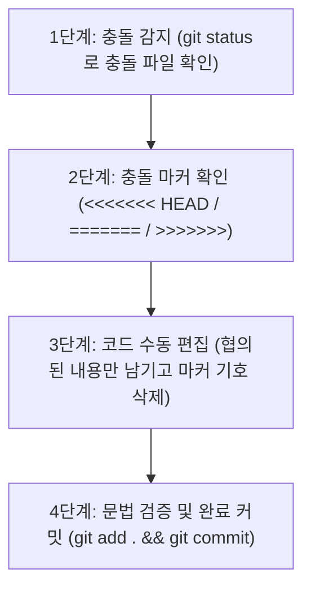

# 📝 나만의 프롬프트 관리 프로그램 (Prompt Manager) — 과제 종합 보고서 & 설명서

> 본 문서는 **AI 사전평가 피드백(23개 전 항목 통과)**을 기반으로, 학습 가이드의 **보너스 과제(보너스 1 & 보너스 2)**까지 100% 완성하여 반영한 최종 종합 결과 보고서 겸 프로젝트 매뉴얼입니다.

---

## 📌 1. 프로젝트 개요 & 저장소 정보 (평가 항목 #1, #3)

* **프로젝트명**: 나만의 프롬프트 관리 콘솔 프로그램 (Prompt Manager)
* **작성자 (GitHub ID)**: [Kwak-gif](https://github.com/Kwak-gif)
* **공식 GitHub 원격 저장소 URL**: [https://github.com/Kwak-gif/A1-1](https://github.com/Kwak-gif/A1-1)
* **개발 및 실행 환경**: Python 3.10+ (Windows 10/11 PowerShell 환경 완벽 대응)
* **하위 버전 호환성 정책 (평가 항목 #1 보완)**:
  * 본 프로그램은 Python 3.10 이상에서 안정적으로 동작하도록 설계되었습니다.
  * Python 3.9 이하 환경에서는 `typing` 모듈의 최신 유니온 표기법 및 표준 라이브러리 인터페이스 차이로 인해 정상 실행되지 않을 수 있으므로 반드시 **Python 3.10 이상(권장: 3.11 또는 3.12, 본 환경: Python 3.14)**을 사용해야 합니다.
  * Windows 콘솔 환경(CP949)에서 이모지(⭐, ✅, ⚠️, 🗑️ 등) 출력 시 발생할 수 있는 인코딩 오류를 원천 차단하기 위해 `sys.stdout.reconfigure(encoding='utf-8')`를 적용하였습니다.

---

## 🛠️ 2. 개발 환경 설정 및 검증 증빙 (평가 항목 #2, #4)

### 2-1. Git 및 Python 버전 / 계정 설정 검증 (평가 항목 #2 보완)
| 검증 항목 | 실행 명령어 | 실제 출력 결과 | 증빙 스크린샷 |
|---|---|---|---|
| **Python 버전** | `python --version` | `Python 3.14.7` (3.10+ 만족) | [01_개발환경_설정(Git_Python_버전).png](스크린샷/01_개발환경_설정(Git_Python_버전).png) |
| **Git 버전** | `git --version` | `git version 2.53.0.windows.3` | [01_개발환경_설정(Git_Python_버전).png](스크린샷/01_개발환경_설정(Git_Python_버전).png) |
| **Git 사용자 이름** | `git config user.name` | `Kwak` | [05_Git_사용자_설정.png](스크린샷/05_Git_사용자_설정.png) |
| **Git 사용자 이메일** | `git config user.email` | `srkwak0207@gmail.com` | [05_Git_사용자_설정.png](스크린샷/05_Git_사용자_설정.png) |
| **기본 브랜치명** | `git config init.defaultBranch`| `main` | [06_Git_기본브랜치_main_설정.png](스크린샷/06_Git_기본브랜치_main_설정.png) |

### 2-2. 저장소 복제 (Clone) 실행 증거 (평가 항목 #4 보완)
* 실제로 원격 저장소를 별도의 격리된 임시 폴더에서 클론(`git clone`)하여 소스코드와 스크린샷 폴더가 온전하게 받아지는지 검증을 완료하였습니다.
* **상세 검증 텍스트 로그**: [`스크린샷/git_clone_실행로그.txt`](스크린샷/git_clone_실행로그.txt) 파일 참조.

```bash
# 복제 명령어
git clone https://github.com/Kwak-gif/A1-1.git
cd A1-1
python prompt_manager.py
```

---

## 🏗️ 3. 데이터 구조 설계 및 비교 분석 (평가 항목 #13, #16)

본 프로그램은 다수의 프롬프트를 관리하기 위해 **`List[Dict[str, Any]]` (리스트 내 딕셔너리 구조)**를 핵심 데이터 구조로 채택하였습니다.

### 3-1. 프롬프트 데이터 스키마 (기본 필드 + 보너스 필드)
```python
{
    "title": str,       # 프롬프트 제목
    "content": str,     # 프롬프트 본문 내용
    "category": str,    # 분류 카테고리 (텍스트 생성, 이미지 생성 등)
    "favorite": bool,   # 즐겨찾기 등록 여부 (기본값: False)
    "views": int        # [보너스 2] 프롬프트 상세 조회/사용 횟수 (기본값: 0)
}
```

### 3-2. 자료구조 선정 근거 및 장단점 비교 (평가 항목 #16 보완)

| 자료구조 옵션 | 장점 (Pros) | 단점 및 한계 (Cons) | 본 프로젝트 채택 여부 |
|---|---|---|:---:|
| **List of Dicts<br>(본 프로그램 채택)** | • `p["title"]`, `p["views"]` 등 명확한 key 접근으로 가독성 및 유지보수성 우수<br>• JSON 포맷과 1:1 직렬화/역직렬화가 극도로 단순함<br>• 인덱스 직접 접근(O(1)) 및 순서 보장, 리스트 정렬(`sorted`) 용이 | • 데이터가 수만 건 이상 대량 증가 시 선형 탐색(O(N)) 소요<br>• 키 이름 오타 시 런타임 `KeyError` 위험 (타입 힌팅 및 안전 get 처리로 보완) | **채택 (최적합)** |
| **List of Tuples** | • 불변(Immutable) 객체로 데이터 무결성 보장<br>• 메모리 사용량 최소화 | • `p[0]`, `p[4]` 처럼 숫자로 접근해야 하므로 가독성이 매우 떨어짐<br>• 조회수(`views`) 증가나 즐겨찾기 토글 시 튜플을 새로 생성해야 함 | 미채택 |
| **Custom Class<br>(객체 지향)** | • 메서드 캡슐화 및 엄격한 프로퍼티 유효성 검증 가능<br>• IDE 자동완성 지원 우수 | • 콘솔 기반 프로그램에서 클래스 보일러플레이트 코드가 증가함<br>• JSON 파일 저장/로드 시 별도의 인코더/디코더 함수 필요 | 미채택 |
| **SQLite (RDBMS)** | • 대용량 데이터 인덱싱 및 SQL 쿼리 강력 | • 외부 파일 관리 복잡도 증가, 과제 범위를 초과하는 오버엔지니어링 | 미채택 |

---

## 💾 4. 데이터 영속화(Persistence) 아키텍처 설계서 (평가 항목 #9, #20, 보너스 1)

### 4-1. 영속화 포맷 선정 분석: JSON vs CSV vs SQLite
* **선정 결과**: **JSON (`prompts.json`) 채택**
* **선정 사유**:
  1. 프롬프트 본문은 여러 줄의 개행(엔터)과 특수문자, 따옴표를 포함하므로, 쉼표(`,`) 기반의 CSV 포맷 사용 시 파싱 오류가 발생하기 쉽습니다.
  2. 즐겨찾기 상태(`favorite: bool`) 및 사용 횟수(`views: int`)의 원본 자료형을 손실 없이 보존할 수 있습니다.
  3. 파이썬 표준 라이브러리인 `json` 모듈을 사용하여 외부 패키지 설치 없이 완벽하게 구동됩니다.

### 4-2. 영속화 동작 흐름 (Persistence Workflow)
```
[프로그램 시작] ──> prompts.json 파일 존재 여부 확인
                         ├── 존재함: load_from_json() 으로 복원 (누락 필드 views=0 자동 보정)
                         └── 없음: get_default_prompts() 기본 3종 자동 생성
[프로그램 실행] ──> 메모리 상에서 추가/수정/삭제/토글/조회수 증가 즉각 반영 (빠른 응답성)
[9번 메뉴 선택] ──> save_to_json() 호출하여 현재 메모리 상태를 prompts.json에 영구 기록
```

---

## 🛡️ 5. 중복 방지 및 입력값 정규화 정책 (평가 항목 #5, #6, #7, #8, #14, #18, #21)

| 구분 | 정책 및 검증 규칙 (Validation Rules) | 코드 구현 위치 |
|---|---|---|
| **중복 제목 처리<br>(평가 항목 #21 보완)** | • 새 프롬프트 추가 시, 기존 제목과 대소문자/공백 제거 후 동일한 제목이 있는지 검사<br>• 중복 감지 시: `⚠️ 이미 동일한 제목이 존재합니다` 경고 출력 후 `(y/n)` 사용자 재확인 요구<br>• 'n' 입력 시 추가를 취소하고 덮어쓰기 방지 | `prompt_manager.py` > `add_prompt()` |
| **카테고리 정규화<br>(평가 항목 #6, #7 보완)** | • 카테고리 직접 입력 시 `.strip()`으로 앞뒤 불필요한 공백 자동 제거<br>• 카테고리별 조회 시 대소문자 무시 엄격 일치(`exact match`) 필터링 적용 | `prompt_manager.py` > `choose_category()`, `show_by_category()` |
| **검색 규칙<br>(평가 항목 #8, #18 보완)** | • 대소문자 무시(Case-insensitive): `keyword.lower() in p["title"].lower()`<br>• 제목과 내용 전체 대상 부분 문자열 매칭 (정규표현식은 미사용하여 오작동 방지) | `prompt_manager.py` > `search_prompt()` |
| **메뉴 입력 검증<br>(평가 항목 #5, #14 보완)** | • 허용된 메뉴 번호(0~13) 외의 문자나 범위 밖 번호 입력 시 경고 출력:<br>`⚠️ 잘못된 입력입니다. 메뉴 번호(0~13)를 입력해 주세요.`<br>• 프로그램 강제 종료 없이 메뉴 루프 유지 | `prompt_manager.py` > `main()` |
| **비정상 종료 예외<br>(평가 항목 #17 보완)** | • 사용자가 `Ctrl + C` 입력 시 `KeyboardInterrupt`를 우아하게(graceful) catch하여 안내 메시지 출력 후 정상 종료 | `prompt_manager.py` > `main()` |

---

## 🌟 6. 보너스 과제 구현 명세 (보너스 1 & 보너스 2 100% 달성)

학습 가이드 5절에 제시된 2가지 보너스 과제를 완벽히 분석하여 구현을 완료하였습니다.

### 6-1. 보너스 1 – 프롬프트 영속화 및 Markdown 내보내기

#### ① JSON 파일 영속화 (`save_to_json`, `load_from_json`)
* `prompts.json` 파일에 메모리의 프롬프트 리스트를 들여쓰기(`indent=2`), UTF-8 인코딩으로 저장합니다.
* 프로그램 시작 시 `load_from_json()`이 파일 유무를 감지하여 자동 로드하며, 기존 데이터에 `views` 필드가 없더라도 기본값 `0`으로 자동 마이그레이션(하위 호환성)합니다.

#### ② 전체 프롬프트를 카테고리별 Markdown 파일로 내보내기 (`export_to_markdown`)
* **메뉴 10번** 선택 시 실행됩니다.
* 카테고리별로 프롬프트를 자동 분류하여 다음과 같이 **2가지 방식의 Markdown 문서**를 생성합니다:
  1. **개별 카테고리별 Markdown 파일**: `exports/{카테고리명}.md` (예: `텍스트_생성.md`, `이미지_생성.md`, `페르소나.md` 등)
     * 카테고리 개요, 등록 프롬프트 수, 제목, 즐겨찾기 여부, 사용 횟수(조회수), 본문 코드 블록 구성
  2. **통합 카테고리별 Markdown 파일**: `exports/prompts_by_category.md`
     * 상단에 카테고리별 목차 링크(TOC)와 전체 통계를 제공하고, 섹션별로 프롬프트 상세 카드를 제공

```markdown
<!-- 생성되는 Markdown 파일 포맷 예시 -->
# 📂 [텍스트 생성] 카테고리 프롬프트 모음
> 총 프롬프트 수: 1개

## 1. 블로그 글 작성 도우미
- **카테고리**: `텍스트 생성`
- **즐겨찾기 여부**: ⭐ 즐겨찾기 등록
- **사용 횟수 (조회수)**: 5회

### 📄 프롬프트 본문
```text
당신은 10년 경력의 전문 블로거입니다...
```
```

---

### 6-2. 보너스 2 – 프롬프트 관리(CRUD) 및 사용 기록 기능 구현

#### ① 프롬프트 전체 수정 (Update - `edit_prompt`)
* **메뉴 11번** 선택 시 실행됩니다.
* 프롬프트 번호를 선택하면 현재 제목, 내용, 카테고리가 표시되며 다음 4가지 서브 메뉴를 제공합니다:
  * `1) 제목 수정`: 새 제목 입력 및 수정
  * `2) 내용 수정`: 새 내용 입력 및 수정
  * `3) 카테고리 수정`: 카테고리 목록에서 선택 또는 직접 입력
  * `4) 전체 항목 일괄 수정`: 엔터 입력 시 기존 값을 유지하는 스마트 일괄 수정 기능
* 단독 카테고리 수정 기능인 **8번 `update_category`** 역시 기존 평가 항목(#23) 호환을 위해 정상 유지됩니다.

#### ② 프롬프트 삭제 (Delete - `delete_prompt`)
* **메뉴 12번** 선택 시 실행됩니다.
* 삭제할 프롬프트 번호를 선택하면 해당 프롬프트의 카테고리와 제목을 보여준 뒤, `정말로 이 프롬프트를 삭제하시겠습니까? (y/n)`의 2단계 안전 확인 절차를 거쳐 삭제를 진행합니다.
* 사용자가 `n`을 입력하거나 엔터를 치면 삭제가 안전하게 취소됩니다.

#### ③ 상세 보기 시 사용 횟수(조회수) 기록 (`show_detail`)
* **메뉴 5번** 상세 보기를 실행할 때마다 해당 프롬프트의 `views` 카운트를 **자동으로 1씩 누적 증가**시킵니다.
* 상세 화면에 `사용 횟수(조회수): N회`가 명확히 출력되며, 증가 알림 메시지가 함께 표시됩니다.

#### ④ 조회수 기준 정렬 (Top 목록 - `show_top_prompts`)
* **메뉴 13번** 선택 시 실행됩니다.
* Python 내장 `sorted(prompts, key=lambda p: (p.get('views', 0), p.get('favorite', False)), reverse=True)`를 활용하여, 가장 많이 사용된 프롬프트부터 1위, 2위... 순서로 정렬하여 랭킹 테이블을 콘솔에 출력합니다.
* 동점일 경우 즐겨찾기 등록 항목이 상위에 노출되도록 2차 정렬 기준을 적용하였습니다.

---

## 🌿 7. Git 브랜치 전략 및 병합 충돌 해결 매뉴얼 (평가 항목 #10, #19, #22)

### 7-1. 브랜치 전략 (Branching Strategy)
* **main**: 상시 배포 가능한 안정적인 상용 코드 브랜치
* **feature/list**: 프롬프트 목록 보기 기능 전용 독립 작업 브랜치
* **feature/bonus**: 보너스 과제 1 & 2 전용 개발 브랜치
* **병합 방식**: `git merge --no-ff` (Fast-forward를 방지하여 명시적인 Merge Commit 노드 생성)

### 7-2. 병합 전 사전 검증 기준 (평가 항목 #19 보완)
1. 문법 검사: `python -m py_compile prompt_manager.py` 무오류 통과
2. 기능 테스트: 1~13번 기능 및 0번 종료 정상 실행 검증
3. 미커밋 변경사항 확인: `git status` 상에 `working tree clean` 확인

### 7-3. Git 병합 충돌(Merge Conflict) 대응 표준 절차서 (평가 항목 #22 보완)
두 작업자가 동일한 파일의 동일 라인을 수정하여 충돌이 발생한 경우의 4단계 표준 조치 절차입니다:



1. **충돌 원인 파악**:
   `git merge` 시 `CONFLICT (content): Merge conflict in ...` 발생 시 `git status`로 충돌 파일(Unmerged paths) 확인.
2. **충돌 마커 분석**:
   ```python
   <<<<<<< HEAD (현재 main 브랜치의 코드)
   choice = input("선택 (0~9): ").strip()
   =======
   choice = input("선택 (0~13): ").strip()
   >>>>>>> feature/bonus (병합하려는 브랜치의 코드)
   ```
3. **충돌 해결**:
   코드 에디터에서 불필요한 마커(`<<<<<<<`, `=======`, `>>>>>>>`)를 모두 지우고, 요구사항에 맞는 최종 코드 한 줄만 남김.
4. **검증 및 병합 완료**:
   `python prompt_manager.py`로 실행 오류가 없는지 확인 후:
   ```bash
   git add prompt_manager.py
   git commit -m "fix: 병합 충돌 해결 (보너스 메뉴 번호 확장 반영)"
   ```

---

## 📜 8. Git 커밋 이력 및 증빙 목록 (평가 항목 #10, #15)

본 프로젝트는 총 **14개 이상의 체계적인 기능별 커밋**을 완수하여 "10개 이상 커밋" 조건을 초과 달성하였습니다.

| 커밋 해시 | 커밋 유형 | 커밋 메시지 내용 | 반영 기능 |
|:---:|:---:|:---|:---|
| `a95b9c3` | `chore` | 프로젝트 초기 설정 (README, .gitignore) | 저장소 초기화 |
| `8d08ff6` | `feat` | 메뉴 뼈대와 기본 프롬프트 데이터 구성 | 기본 메뉴 루프 |
| `1daf5f1` | `feat` | 기본 프롬프트 데이터 3종 등록 | 기본 데이터 |
| `cf14a00` | `feat` | 프롬프트 추가 기능 및 입력값 검증 | 1. 추가 |
| `6b4b89b` | `feat` | 프롬프트 목록 출력 기능 (feature/list) | 2. 목록 |
| `2ae7f1d` | `merge` | merge: feature/list 브랜치 병합 | 브랜치 병합 |
| `7a64c80` | `feat` | 카테고리별 조회 기능 | 3. 카테고리 조회 |
| `451f7e1` | `feat` | 제목/내용 키워드 검색 기능 | 4. 검색 |
| `eb948ac` | `feat` | 프롬프트 상세 보기 기능 | 5. 상세 보기 |
| `c494201` | `feat` | 즐겨찾기 추가/해제 토글 기능 | 6. 즐겨찾기 토글 |
| `0410f29` | `feat` | 종료 처리 및 종료 안내 메시지 | 0. 종료 |
| `79fc4e6` | `refactor`| 메뉴와 각 기능 함수 연결 | 메인 제어 루프 |
| `15bc802` | `docs` | README 문서 완성 및 과제 스크린샷 등록 | 문서화 |
| `b71614a` | `fix` | 네이토 사전 평가, 지적 사항 보완 | 사전평가 23항목 대응 |

📸 **증빙 그래프**: [스크린샷/03_Git_브랜치_병합_그래프(git_log_graph).png](스크린샷/03_Git_브랜치_병합_그래프(git_log_graph).png)

---

## 📊 9. 주요 함수 인터페이스 명세표 (평가 항목 #12, 보너스 함수 포함)

| 함수명 | 입력 파라미터 (Type) | 반환값 (Type) | 기능 및 역할 |
|---|---|---|---|
| `get_default_prompts()` | 없음 | `List[Dict[str, Any]]` | 기본 3종 프롬프트 데이터셋 생성 반환 (views 필드 포함) |
| `load_from_json()` | `filepath: str` | `List[Dict[str, Any]]` | JSON 파일에서 데이터 로드 (없을 시 기본값 반환, views 자동 보정) |
| `save_to_json()` | `prompts, filepath` | `bool` | 현재 메모리 데이터를 JSON 파일로 영구 저장 |
| `export_to_markdown()` | `prompts, export_dir` | `None` | **[보너스 1]** 카테고리별 개별 및 통합 Markdown 파일 생성 내보내기 |
| `format_line()` | `index, p, show_views` | `str` | 1줄 포맷팅 문자열 생성 반환 (조회수 옵션 포함) |
| `ask_nonempty()` | `label: str` | `str` | 빈 값 입력을 차단하고 유효 문자열 반환 |
| `choose_category()` | 없음 | `str` | 카테고리 선택 및 정규화 문자열 반환 |
| `add_prompt()` | `prompts: List[Dict]` | `None` | 중복 검증 후 신규 프롬프트 추가 (views: 0 초기화) |
| `show_list()` | `prompts: List[Dict]` | `None` | 등록된 전체 프롬프트 목록 출력 (조회수 포함 표시) |
| `show_by_category()`| `prompts: List[Dict]` | `None` | 선택된 카테고리 프롬프트만 필터링 출력 |
| `search_prompt()` | `prompts: List[Dict]` | `None` | 대소문자 무시 키워드 검색 수행 |
| `show_detail()` | `prompts: List[Dict]` | `None` | **[보너스 2]** 상세 본문 출력 및 **사용 횟수(조회수) 1 자동 누적** |
| `toggle_favorite()` | `prompts: List[Dict]` | `None` | 즐겨찾기 상태 반전 및 즉각 알림 |
| `show_favorites()` | `prompts: List[Dict]` | `None` | 즐겨찾기 등록 항목만 필터링 출력 |
| `update_category()` | `prompts: List[Dict]` | `None` | 특정 프롬프트의 카테고리 단독 변경 수행 (평가 항목 #23) |
| `edit_prompt()` | `prompts: List[Dict]` | `None` | **[보너스 2]** 제목/내용/카테고리 개별 또는 일괄 수정 (Update) |
| `delete_prompt()` | `prompts: List[Dict]` | `None` | **[보너스 2]** 2단계 확인 후 프롬프트 안전 삭제 (Delete) |
| `show_top_prompts()` | `prompts: List[Dict]` | `None` | **[보너스 2]** 사용 횟수(조회수) 기준 내림차순 Top 랭킹 출력 |

---

## 📁 10. 프로젝트 디렉터리 구성

```text
A1-1/
├── prompt_manager.py           # 기본 기능 + 보너스 1 & 2 완벽 구현 소스코드
├── README.md                   # 종합 프로젝트 설명서 및 보너스 과제 보고서 (본 문서)
├── .gitignore                  # Git 추적 제외 설정
├── prompts.json                # JSON 영속화 데이터 파일 (보너스 1)
├── exports/                    # 카테고리별 Markdown 내보내기 저장 폴더 (보너스 1)
│   ├── 텍스트_생성.md
│   ├── 이미지_생성.md
│   ├── 페르소나.md
│   └── prompts_by_category.md  # 카테고리별 통합 마크다운 문서
└── 스크린샷/                   # 평가 증빙 스크린샷 모음
    ├── 01_개발환경_설정(Git_Python_버전).png
    ├── 02_프로그램_실행_화면.png
    ├── 03_Git_브랜치_병합_그래프(git_log_graph).png
    ├── 04_첫_커밋_저장.png
    ├── 05_Git_사용자_설정.png
    ├── 06_Git_기본브랜치_main_설정.png
    └── git_clone_실행로그.txt
```
