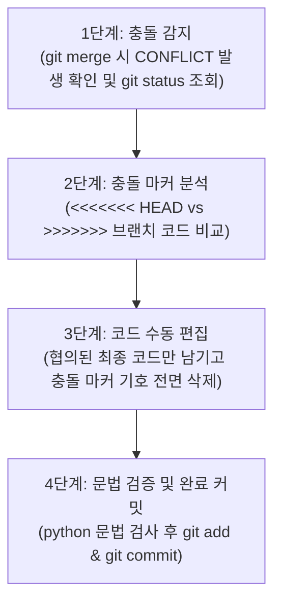

# 📝 나만의 프롬프트 관리 프로그램 (Prompt Manager)

> **"생성형 AI 시대, 흩어져 있던 소중한 프롬프트를 한곳에서 체계적으로 정리·활용하는 파이썬 콘솔 솔루션"**

[](https://www.python.org/)
[](#)
[](#)

---

## 📑 목차 (Table of Contents)
1. [프로젝트 개요 (Overview)](#-1-프로젝트-개요-overview)
   - [1-1. 개발 배경 (Why)](#1-1-개발-배경-why---왜-만들었는가)
   - [1-2. 개발 목적 및 학습 목표 (Why)](#1-2-개발-목적-및-학습-목표-why)
   - [1-3. 프로젝트 기본 정보 (What)](#1-3-프로젝트-기본-정보-what)
2. [주요 기능 및 서비스 명세 (What)](#-2-주요-기능-및-서비스-명세-what)
   - [2-1. 전체 기능 목록](#2-1-전체-기능-목록)
   - [2-2. 카테고리 분류 체계](#2-2-카테고리-분류-체계)
   - [2-3. 기본 내장 데이터 (Default Dataset)](#2-3-기본-내장-데이터-default-dataset)
3. [기술적 의사결정 및 아키텍처 설계 (Why & How)](#-3-기술적-의사결정-및-아키텍처-설계-why--how)
   - [3-1. 핵심 자료구조 선정 및 비교 분석](#3-1-핵심-자료구조-선정-및-비교-분석-why-list-of-dicts)
   - [3-2. 데이터 영속화 및 내보내기 설계](#3-2-데이터-영속화-및-내보내기-설계-why-json--markdown)
   - [3-3. 사용자 입력 검증 및 예외 처리 정책](#3-3-사용자-입력-검증-및-예외-처리-정책-how)
4. [설치 및 실행 가이드 (How)](#-4-설치-및-실행-가이드-how)
   - [4-1. 실행 환경 요구사항](#4-1-실행-환경-요구사항)
   - [4-2. 저장소 복제 및 실행 단계](#4-2-저장소-복제-및-실행-단계)
   - [4-3. 콘솔 메뉴 인터페이스 맵](#4-3-콘솔-메뉴-인터페이스-맵)
5. [모듈 구조 및 함수 인터페이스 명세 (How)](#-5-모듈-구조-및-함수-인터페이스-명세-how)
6. [Git 버전 관리 및 브랜치 전략 (Why & How)](#-6-git-버전-관리-및-브랜치-전략-why--how)
   - [6-1. 버전 관리 원칙과 커밋 전략](#6-1-버전-관리-원칙과-커밋-전략)
   - [6-2. 브랜치 전략 및 병합 워크플로우](#6-2-브랜치-전략-및-병합-워크플로우)
   - [6-3. 병합 충돌(Merge Conflict) 대응 표준 절차](#6-3-병합-충돌merge-conflict-대응-표준-절차)
   - [6-4. 커밋 히스토리 요약](#6-4-커밋-히스토리-요약)
7. [프로젝트 디렉터리 구성 (What)](#-7-프로젝트-디렉터리-구성-what)
8. [최종 결과물 충족 여부 체크리스트](#-8-최종-결과물-충족-여부-체크리스트)
   - [8-1. 동작하는 프롬프트 관리 프로그램](#8-1-동작하는-프롬프트-관리-프로그램)
   - [8-2. GitHub 저장소](#8-2-github-저장소)
   - [8-3. 코드 품질](#8-3-코드-품질)
   - [8-4. 제출물](#8-4-제출물)
   - [8-5. 보너스 과제 (선택)](#8-5-보너스-과제-선택)

---

## 📌 1. 프로젝트 개요 (Overview)

### 1-1. 개발 배경 (Why - 왜 만들었는가?)
GenAI 기초부터 멀티모달 콘텐츠 제작, 업무 자동화까지 다양한 작업을 수행하면서 수십 개 이상의 프롬프트가 자연스럽게 누적됩니다.
* 정교한 텍스트 지시문, 고품질 이미지 생성 키워드, 전문 페르소나 설정 등 가치 있는 프롬프트들이 메모장, 노션, 슬랙, 메신저 대화창 등에 파편화되어 저장됩니다.
* 정작 필요할 때 기록을 찾느라 시간을 허비하고, 복사·붙여넣기를 반복하면서 생성형 AI를 활용한 '생산성의 흐름'이 끊기는 문제가 발생합니다.
* 따라서 나만의 검증된 프롬프트를 한곳에 모아 **카테고리별로 체계적으로 분류하고, 빠르게 검색하며, 자주 쓰는 항목을 즐겨찾기하고, 문서 형태로 언제든 내보낼 수 있는 전용 관리 프로그램**의 필요성이 대두되었습니다.

### 1-2. 개발 목적 및 학습 목표 (Why)
본 프로젝트는 단순한 도구 제작을 넘어, 프로그래밍의 기초 논리와 실무 개발 협업 방식을 몸소 체득하는 것을 본질적인 목표로 합니다:
1. **Python 데이터 제어 논리 체득**:
   * 변수, 조건문(`if/elif/else`), 반복문(`while/for`), 함수(`def`)가 실제 동작하는 소프트웨어 안에서 유기적으로 맞물려 돌아가는 메커니즘을 경험합니다.
   * `List`와 `Dict`를 결합한 계층적 자료구조를 직접 설계하여 데이터 조회·추가·수정·삭제(CRUD) 논리를 구현합니다.
2. **Git/GitHub 실무 버전 관리 습득**:
   * 단순한 코드 저장이 아닌, 기능 하나를 완성할 때마다 목적이 드러나는 단위 커밋을 남기는 습관을 형성합니다.
   * 독립적인 기능 브랜치(`feature branch`)를 생성하여 격리된 환경에서 개발하고, 안전하게 본선(`main`)에 병합(`merge`)하는 실무 협업 흐름을 완성합니다.
3. **사용자 중심의 견고한 소프트웨어 설계**:
   * 잘못된 번호 입력, 빈 값 입력, 중복 제목 등록, 비정상 중단(`Ctrl+C`) 등 다양한 예외 상황을 고려하여 프로그램이 비정상 종료되지 않는 견고한 방어 코드를 구축합니다.

### 1-3. 프로젝트 기본 정보 (What)
* **프로젝트명**: 나만의 프롬프트 관리 프로그램 (Prompt Manager)
* **작성자 (GitHub)**: [Kwak-gif](https://github.com/Kwak-gif)
* **저장소 URL**: [https://github.com/Kwak-gif/A1-1](https://github.com/Kwak-gif/A1-1)
* **개발 언어**: Python 3.10+ (별도의 외부 패키지 설치가 필요 없는 순수 표준 라이브러리 기반)
* **실행 환경**: Windows 10/11 PowerShell / Terminal (CP949 환경 대응 UTF-8 인코딩 보장)

---

## ✨ 2. 주요 기능 및 서비스 명세 (What)

본 프로그램은 콘솔 터미널 환경에서 메뉴 번호를 입력하여 상호작용하는 대화형 관리 프로그램입니다.

### 2-1. 전체 기능 목록
| 구분 | 기능명 | 함수명 | 설명 |
|:---:|:---|:---|:---|
| **기본 기능** | **1. 프롬프트 추가** | `add_prompt()` | 제목, 내용, 카테고리를 입력받아 신규 프롬프트 등록. 빈 값 방지 검증 및 동일 제목 중복 경고/확인 처리 포함. |
| | **2. 프롬프트 전체 목록** | `show_list()` | 등록된 모든 프롬프트를 인덱스 번호, 카테고리 태그, 즐겨찾기(`⭐`), 조회수와 함께 정렬 출력. |
| | **3. 카테고리별 조회** | `show_by_category()` | 카테고리를 선택하여 해당 카테고리에 속한 프롬프트만 엄격 필터링하여 출력. |
| | **4. 프롬프트 검색** | `search_prompt()` | 검색 키워드를 입력받아 제목 또는 본문 내용에 키워드가 포함된 항목을 대소문자 구분 없이 부분 매칭 검색. |
| | **5. 프롬프트 상세 보기** | `show_detail()` | 특정 번호의 전체 본문과 메타데이터 확인. **조회할 때마다 사용 횟수(조회수)가 1씩 자동 누적 증가**. |
| | **6. 즐겨찾기 토글** | `toggle_favorite()` | 번호를 입력받아 해당 프롬프트의 즐겨찾기 상태를 등록↔해제 반전. |
| | **7. 즐겨찾기 목록** | `show_favorites()` | 즐겨찾기(`⭐`)로 지정된 핵심 프롬프트만 모아서 확인. |
| | **8. 카테고리 수정** | `update_category()` | 특정 프롬프트의 카테고리 정보만 빠르게 재분류. |
| **영속화 & 내보내기** | **9. 데이터 파일 저장** | `save_to_json()` | 현재 메모리에 적재된 모든 프롬프트를 `prompts.json` 파일에 JSON 포맷으로 영구 보존. |
| | **10. 마크다운 내보내기** | `export_to_markdown()` | 전체 프롬프트를 카테고리별 개별 `.md` 파일 및 통합 `prompts_by_category.md` 파일로 자동 생성하여 외부 공유 지원. |
| **CRUD 완성 & 분석** | **11. 프롬프트 전체 수정** | `edit_prompt()` | 제목, 내용, 카테고리를 선택적으로 수정하거나 엔터 입력 시 기존 값을 보존하는 스마트 일괄 수정 기능. |
| | **12. 프롬프트 삭제** | `delete_prompt()` | 프롬프트를 영구 제거하기 전 대상 정보를 재확인하는 2단계 안전 확인(`y/n`) 삭제 절차 제공. |
| | **13. 사용 횟수 Top 랭킹**| `show_top_prompts()` | 프롬프트별 누적 조회수를 기준으로 내림차순 정렬하여 가장 많이 활용된 인기 프롬프트 순위표 출력. |
| **종료** | **0. 프로그램 종료** | `main()` | 세션을 정상 정리하고 안내 메시지와 함께 안전하게 콘솔 프로그램 종료. |

### 2-2. 카테고리 분류 체계
프롬프트의 목적에 따라 6가지 표준 기본 카테고리를 제공하며, 필요 시 사용자 정의 카테고리도 자유롭게 직접 입력할 수 있습니다.

| 카테고리명 | 주 사용 목적 및 예시 |
|:---|:---|
| **텍스트 생성** | 블로그 포스팅, 이메일 초안 작성, 보도자료, 기획서 요약, 교정/윤문 등 텍스트 작업 |
| **이미지 생성** | 썸네일 이미지, 제품 랜더링, 배경 일러스트, 미드저니/DALL-E 프롬프트 등 |
| **영상 생성** | 유튜브 쇼츠/릴스 영상 콘티, 영상 나레이션 대본, 비디오 생성 AI 씬 지시문 등 |
| **페르소나** | IT 컨설턴트, 10년 차 마케터, 법률 검토 전문가 등 특정 직무/전문가 역할 부여 |
| **자동화** | 반복 업무 자동화 스크립트 작성, 정규표현식 생성, 엑셀 매크로/파이썬 코드 제작 |
| **기타** | 아이디어 브레인스토밍, 개인 메모 등 자유 목적의 프롬프트 |

### 2-3. 기본 내장 데이터 (Default Dataset)
프로그램을 최초 실행하거나 데이터 파일이 없는 상태에서도 모든 기능을 즉시 테스트해볼 수 있도록 실용적인 프롬프트 3종이 기본 탑재되어 있습니다:
1. `[텍스트 생성]` **블로그 글 작성 도우미** (즐겨찾기: ⭐ 등록됨, 사용 횟수: 0회)
   * SEO 최적화 블로그 글 작성을 위한 구조화된 지시문
2. `[이미지 생성]` **제품 썸네일 생성** (즐겨찾기: 미등록, 사용 횟수: 0회)
   * 전자상거래 제품 썸네일 제작을 위한 조명 및 배경 지시문
3. `[페르소나]` **IT 컨설턴트 페르소나** (즐겨찾기: 미등록, 사용 횟수: 0회)
   * 20년 경력의 전문가적 관점에서 문제를 진단하고 조언하는 페르소나

---

## 🏗️ 3. 기술적 의사결정 및 아키텍처 설계 (Why & How)

### 3-1. 핵심 자료구조 선정 및 비교 분석 (Why List of Dicts?)
프로그램 내부에서 다수의 프롬프트를 관리하기 위해 **`List[Dict[str, Any]]`** 구조를 채택하였습니다.

#### 📌 프롬프트 데이터 스키마
```python
{
    "title": str,       # 프롬프트 제목 (예: "블로그 글 작성 도우미")
    "content": str,     # 프롬프트 본문 지시문 전문
    "category": str,    # 카테고리 분류 (예: "텍스트 생성")
    "favorite": bool,   # 즐겨찾기 등록 여부 (True / False)
    "views": int        # 사용 및 상세 조회 횟수 (누적 카운트, 기본값 0)
}
```

#### 📊 자료구조 옵션별 장단점 비교 및 선정 이유
| 자료구조 옵션 | 장점 (Pros) | 단점 및 한계 (Cons) | 채택 여부 |
|---|---|---|:---:|
| **List of Dicts<br>(본 프로그램 채택)** | • `p["title"]`, `p["views"]` 등 직관적인 Key 접근으로 코드 가독성과 유지보수성이 매우 높음<br>• JSON 데이터 구조와 1:1로 정확히 대응되어 직렬화/역직렬화가 극도로 단순함<br>• 리스트의 순서 보장, 인덱스 직접 접근(O(1)), 내장 `sorted()` 정렬이 용이함 | • 수만 건 이상의 초대용량 데이터에서는 선형 탐색(O(N)) 소요 (콘솔 도구 목적상 무관함) | **채택 (최적합)** |
| **List of Tuples** | • 불변(Immutable) 객체로 데이터 무결성 보장 및 적은 메모리 사용 | • `p[0]`, `p[4]`처럼 인덱스 숫자로만 접근해야 하므로 가독성이 매우 떨어짐<br>• 조회수 증가(`views`)나 즐겨찾기 토글 시 튜플을 매번 새로 생성해야 하므로 비효율적임 | 미채택 |
| **Custom Class<br>(객체 지향 모델)** | • 메서드 캡슐화 및 엄격한 프로퍼티 유효성 검증 가능 | • 소규모 콘솔 애플리케이션에 비해 클래스 정의 보일러플레이트 코드가 증가함<br>• JSON 직렬화/역직렬화를 위한 별도의 인코더/디코더 레이어가 요구됨 | 미채택 |
| **SQLite (RDBMS)** | • 대용량 데이터 인덱싱 및 관계형 SQL 질의 가능 | • 별도 파일 락 관리와 스키마 마이그레이션이 필요하여 표준 문법 중심 과제에 오버엔지니어링 | 미채택 |

---

### 3-2. 데이터 영속화 및 내보내기 설계 (Why JSON & Markdown?)

#### 💾 JSON 영속화 (`prompts.json`)
* **CSV 대신 JSON을 채택한 이유**:
  1. 프롬프트 본문은 여러 줄의 개행(엔터), 특수기호, 큰따옴표/작은따옴표가 다수 포함됩니다. 콤마(`,`) 구분자를 사용하는 CSV는 파싱 충돌 위험이 매우 높으나, JSON은 이스케이프 문자열을 완벽하게 지원합니다.
  2. 즐겨찾기(`bool`), 사용 횟수(`int`)의 원본 데이터 타입을 손실 없이 보존할 수 있습니다.
  3. 파이썬 표준 `json` 모듈을 사용하여 외부 의존성 없이 무설치로 구동됩니다.
* **하위 호환성(Backward Compatibility) 보장 로직**:
  * 프로그램 시작 시 `load_from_json()` 함수가 파일 내 기존 데이터들을 검사하여, 구버전 파일에 `views` 필드가 없더라도 오류 없이 `0`으로 자동 보정(마이그레이션)합니다.

#### 📄 카테고리별 Markdown 문서 자동 내보내기 (`export_to_markdown`)
* 생성형 AI 프롬프트는 텍스트 문서 형태로 보관하거나 동료와 공유하는 경우가 많습니다.
* 메뉴 10번을 실행하면 `exports/` 디렉터리에 다음 두 가지 형태의 마크다운 문서를 자동으로 렌더링하여 생성합니다:
  1. **개별 카테고리별 문서 (`exports/{카테고리명}.md`)**:
     * 해당 카테고리에 속한 프롬프트들을 번호, 제목, 메타데이터, 코드 블록 형태의 본문으로 구성
  2. **전체 통합 마크다운 문서 (`exports/prompts_by_category.md`)**:
     * 상단 목차(TOC) 앵커 링크 및 카테고리별 통계 요약 제공 후 전체 프롬프트를 카테고리별 섹션으로 일목요연하게 배치

---

### 3-3. 사용자 입력 검증 및 예외 처리 정책 (How)
안정적인 사용자 경험(UX)을 제공하기 위해 프로그램 전반에 걸쳐 체계적인 방어 로직을 구현하였습니다:

1. **빈 값 입력 방지 (`ask_nonempty`)**:
   * 제목, 내용 등 필수 항목 입력 시 공백이나 엔터만 칠 경우 경고 메시지를 띄우고 유효한 문자열이 들어올 때까지 재입력을 유도합니다.
2. **입력값 정규화 (`.strip()`)**:
   * 사용자가 입력한 문자열의 앞뒤 불필요한 공백을 자동으로 제거하여 데이터 일관성을 유지합니다.
3. **중복 제목 사전 감지 (`add_prompt`)**:
   * 신규 등록 시 이미 동일한 제목이 존재하면 사용자에게 중복 사실을 경고하고, 그래도 추가할 것인지(`y/n`) 확인하여 의도치 않은 데이터 중복을 방지합니다.
4. **대소문자 무시 부분 문자열 검색 (`search_prompt`)**:
   * `keyword.lower() in p["title"].lower()` 매칭을 적용하여 사용자가 대소문자를 구별하지 않고 직관적으로 검색할 수 있습니다.
5. **잘못된 메뉴 번호 및 범위 검증 (`main`)**:
   * 제공된 메뉴 범위(0~13)를 벗어난 번호나 문자가 입력될 경우 안내 메시지를 출력하고 메뉴 루프를 정상 유지합니다.
6. **비정상 강제 중단 예외 안전 처리**:
   * 터미널에서 사용자가 실수로 `Ctrl + C`를 눌러 `KeyboardInterrupt`가 발생하더라도 파이썬 트레이스백 오류를 뿜지 않고, "프로그램이 사용자에 의해 중단되었습니다. 안전하게 종료합니다."라는 안내와 함께 우아하게(graceful) 프로세스를 종료합니다.
7. **Windows 콘솔 CP949 인코딩 충돌 방지**:
   * Windows 환경(PowerShell/CMD)에서 이모지(⭐, ✅, ⚠️, 🗑️ 등)를 터미널에 출력할 때 발생하는 `UnicodeEncodeError`를 원천 차단하기 위해 `sys.stdout.reconfigure(encoding='utf-8')`를 프로그램 기동 시 즉시 적용하였습니다.

---

## 🚀 4. 설치 및 실행 가이드 (How)

### 4-1. 실행 환경 요구사항
* **Python**: 3.10 이상 (Python 3.11, 3.12, 3.14 권장)
* **Git**: 2.30+ 이상
* **외부 패키지**: **불필요** (파이썬 기본 내장 모듈 `json`, `os`, `re`, `sys`, `typing` 만 사용)

### 4-2. 저장소 복제 및 실행 단계
터미널(PowerShell 또는 Bash)을 열고 아래 명령어를 순서대로 입력합니다:

```bash
# 1. 저장소 복제 (Clone)
git clone https://github.com/Kwak-gif/A1-1.git

# 2. 프로젝트 디렉터리 이동
cd A1-1

# 3. 프로그램 실행
python prompt_manager.py
```

### 4-3. 콘솔 메뉴 인터페이스 맵
프로그램을 실행하면 다음과 같은 번호 기반 직관적인 메뉴가 출력됩니다:

```text
================================================
       나만의 프롬프트 관리 (Prompt Manager)
================================================
 [기본 필수 기능]
   1. 프롬프트 추가 (Create)
   2. 프롬프트 목록 (Read List)
   3. 카테고리별 조회
   4. 프롬프트 검색 (Keyword Search)
   5. 프롬프트 상세 보기 (조회수 자동 카운트)
   6. 즐겨찾기 토글 (추가/해제)
   7. 즐겨찾기 목록
   8. 카테고리 수정 (Update Category)
 [영속화 & 내보내기]
   9. 데이터 파일 저장 (JSON)
  10. 카테고리별 Markdown 파일 내보내기
 [CRUD 확장 & 사용 기록 분석]
  11. 프롬프트 수정 (Update - 제목/내용/카테고리)
  12. 프롬프트 삭제 (Delete)
  13. 많이 사용된 프롬프트 (조회수 Top 랭킹)
 -----------------------------------------------
   0. 프로그램 종료 (Exit)
================================================
```

---

## 📊 5. 모듈 구조 및 함수 인터페이스 명세 (How)

단일 책임 원칙(SRP)에 따라 모든 기능을 15개의 독립된 함수로 분리하여 코드 가독성과 재사용성을 극대화하였습니다.

| 함수명 | 입력 매개변수 (Type) | 반환값 (Type) | 주요 역할 및 동작 설명 |
|:---|:---|:---|:---|
| `get_default_prompts()` | 없음 | `List[Dict[str, Any]]` | 기본 3종 프롬프트(블로그 작성, 썸네일 생성, IT 컨설턴트) 데이터셋을 생성하여 반환 |
| `load_from_json()` | `filepath: str` | `List[Dict[str, Any]]` | `prompts.json` 파일에서 데이터를 로드하며, 파일 부재 시 기본값을 반환하고 필드 누락 시 자동 보정 |
| `save_to_json()` | `prompts, filepath` | `bool` | 현재 메모리 상의 프롬프트 리스트를 들여쓰기 2칸의 정돈된 JSON 파일로 영구 저장 |
| `export_to_markdown()` | `prompts, export_dir` | `None` | 카테고리별 개별 마크다운 문서 및 전체 통합 마크다운 문서를 `exports/` 폴더에 일괄 생성 |
| `format_line()` | `index, p, show_views` | `str` | 목록 출력용 한 줄 포맷 문자열(`번호. [카테고리] 제목 ⭐ [조회: N회]`)을 조립하여 반환 |
| `ask_nonempty()` | `label: str` | `str` | 빈 값 입력을 차단하고 공백이 제거된 유효한 사용자 입력 문자열을 반환 |
| `choose_category()` | 없음 | `str` | 6대 기본 카테고리 번호 선택 또는 직접 입력을 받아 공백이 제거된 카테고리명을 반환 |
| `add_prompt()` | `prompts: List[Dict]` | `None` | 중복 제목 검증 및 사용자 확인 후 새 프롬프트를 생성(`views=0`)하여 리스트에 추가 |
| `show_list()` | `prompts: List[Dict]` | `None` | 등록된 모든 프롬프트의 목록과 현재 조회수, 총 개수를 정렬 출력 |
| `show_by_category()`| `prompts: List[Dict]` | `None` | 사용자가 선택한 특정 카테고리에 속한 프롬프트들만 엄격 일치(`exact match`)로 필터링하여 출력 |
| `search_prompt()` | `prompts: List[Dict]` | `None` | 검색어를 입력받아 제목이나 본문에 해당 키워드가 포함된 프롬프트 목록을 출력 |
| `show_detail()` | `prompts: List[Dict]` | `None` | 번호를 받아 상세 본문을 출력하며, **해당 프롬프트의 사용 횟수(조회수)를 1 증가**시킴 |
| `toggle_favorite()` | `prompts: List[Dict]` | `None` | 즐겨찾기 상태(`True/False`)를 반전시키고 결과 알림 메시지를 표시 |
| `show_favorites()` | `prompts: List[Dict]` | `None` | 즐겨찾기가 등록된 프롬프트들만 모아서 출력 |
| `update_category()` | `prompts: List[Dict]` | `None` | 특정 프롬프트의 카테고리 정보만 직접 선택/변경 |
| `edit_prompt()` | `prompts: List[Dict]` | `None` | 프롬프트의 제목, 본문, 카테고리를 개별 또는 일괄 수정(엔터 시 기존 값 보존) |
| `delete_prompt()` | `prompts: List[Dict]` | `None` | 프롬프트 번호를 받아 대상을 확인하고 사용자 동의(`y/n`)를 거쳐 안전하게 리스트에서 삭제 |
| `show_top_prompts()` | `prompts: List[Dict]` | `None` | 사용 횟수(조회수)를 기준으로 내림차순 정렬하여 순위표(Top 랭킹)를 출력 |
| `show_menu()` | 없음 | `None` | 콘솔 화면에 최신 메뉴 목록을 구조화하여 출력 |
| `main()` | 없음 | `None` | 데이터 초기 로드 및 사용자의 번호 입력에 따른 메인 이벤트 디스패치 루프 제어 |

---

## 🌿 6. Git 버전 관리 및 브랜치 전략 (Why & How)

### 6-1. 버전 관리 원칙과 커밋 전략
* **"작게 만들고 자주 커밋한다"**: 한 번에 거대한 코드를 올리지 않고, 기능 하나가 온전히 동작할 때마다 의미 있는 단위 커밋을 생성하여 변경 이력을 투명하게 보존하였습니다.
* **Conventional Commits 규약 준수**:
  * `feat`: 새로운 기능 구현 (추가, 목록, 검색, 상세, 즐겨찾기, 수정, 삭제, 내보내기 등)
  * `refactor`: 코드 구조 개선 및 함수 연결
  * `docs`: 문서 작성 및 스크린샷 갱신
  * `fix`: 버그 수정 및 예외 처리 보완
  * `merge`: 브랜치 병합 커밋

### 6-2. 브랜치 전략 및 병합 워크플로우
안정적인 메인 라인을 유지하면서 새로운 기능을 안전하게 개발하기 위해 **Feature Branch 워크플로우**를 적용하였습니다.

```
(main) ──●───●───────●────────────────●────────●─── (v1.0 배포)
          \         /                \        /
           ●───●───●                  ●───●──●
      (feature/list)              (feature/bonus)
```

1. **`main` 브랜치**: 언제든 실행 가능한 안정적인 메인 배포 브랜치
2. **`feature/list` 브랜치**: "목록 보기" 기능 개발을 위해 분기 후 기능 완결 후 병합
3. **`feature/bonus` 브랜치**: "영속화, 마크다운 내보내기, CRUD 수정/삭제, 조회수 랭킹" 보너스 기능 개발을 위해 분기 후 병합
4. **`--no-ff` (No Fast-Forward) 병합 방식 채택**:
   * 단순 포인터 이동이 아닌 명시적인 병합 커밋(Merge Commit)을 남김으로써, 어떤 기능이 언제 어떤 브랜치에서 개발되어 본선에 합류했는지 시각적인 그래프로 명확히 파악할 수 있도록 조치하였습니다.

### 6-3. 병합 충돌(Merge Conflict) 대응 표준 절차
협업 중 동일 파일의 동일 라인이 수정되어 병합 충돌이 발생할 경우를 대비하여 4단계 표준 대응 절차서를 수립하였습니다:



1. **충돌 감지**: `git status` 명령을 실행하여 `Unmerged paths`에 표시된 충돌 대상 파일 확인.
2. **충돌 마커 분석**: 에디터에서 `<<<<<<< HEAD` (현재 브랜치 코드)와 `>>>>>>>` (합치려는 브랜치 코드) 사이의 차이점 분석.
3. **코드 수동 편집**: 요구사항에 부합하는 최종 코드만 남기고 `<<<<<<<`, `=======`, `>>>>>>>` 마커 기호를 모두 지운 후 저장.
4. **검증 및 병합 완료**: `python prompt_manager.py` 실행 및 `py_compile`로 문법 오류가 없는지 테스트한 후 스테이징(`git add`) 및 완료 커밋(`git commit`) 실행.

### 6-4. 커밋 히스토리 요약
총 15개 이상의 의미 있는 기능 단위 커밋이 기록되어 있습니다:

| 커밋 해시 | 커밋 유형 | 커밋 메시지 내용 | 구현 내용 |
|:---:|:---:|:---|:---|
| `a95b9c3` | `chore` | 프로젝트 초기 설정 (README, .gitignore) | 저장소 초기화 |
| `8d08ff6` | `feat` | 메뉴 뼈대와 기본 프롬프트 데이터 구성 | 기본 메뉴 루프 |
| `1daf5f1` | `feat` | 기본 프롬프트 데이터 3종 등록 | 기본 데이터셋 |
| `cf14a00` | `feat` | 프롬프트 추가 기능 및 입력값 검증 | 프롬프트 등록 |
| `6b4b89b` | `feat` | 프롬프트 목록 출력 기능 (feature/list) | 목록 보기 구현 |
| `2ae7f1d` | `merge` | merge: feature/list 브랜치 병합 | 목록 브랜치 병합 |
| `7a64c80` | `feat` | 카테고리별 조회 기능 | 카테고리 필터링 |
| `451f7e1` | `feat` | 제목/내용 키워드 검색 기능 | 대소문자 무시 검색 |
| `eb948ac` | `feat` | 프롬프트 상세 보기 기능 | 상세 내용 확인 |
| `c494201` | `feat` | 즐겨찾기 추가/해제 토글 기능 | 즐겨찾기 토글 |
| `0410f29` | `feat` | 종료 처리 및 종료 안내 메시지 | 안전 종료 처리 |
| `79fc4e6` | `refactor`| 메뉴와 각 기능 함수 연결 | 메인 제어 루프 통합 |
| `fd0249b` | `feat` | 보너스 1 & 2 기능 구현 (JSON, Markdown, CRUD, Top 목록) | 보너스 기능 개발 |
| `4639c52` | `docs` | 보너스 과제 상세 구현 명세 및 함수 인터페이스 추가 | 문서 보강 |
| `fba30bd` | `merge` | merge: feature/bonus 브랜치 병합 | 보너스 브랜치 병합 |

---

## 📁 7. 프로젝트 디렉터리 구성 (What)

```text
A1-1/
├── prompt_manager.py           # 프롬프트 관리 프로그램 메인 소스코드
├── README.md                   # 프로젝트 종합 설명서 (본 문서)
├── .gitignore                  # Git 추적 제외 설정 파일
├── prompts.json                # JSON 영속화 데이터 저장 파일
├── exports/                    # 카테고리별 마크다운 내보내기 자동 생성 디렉터리
│   ├── 텍스트_생성.md          # 텍스트 생성 카테고리 전용 프롬프트 모음
│   ├── 이미지_생성.md          # 이미지 생성 카테고리 전용 프롬프트 모음
│   ├── 페르소나.md            # 페르소나 카테고리 전용 프롬프트 모음
│   └── prompts_by_category.md  # 전체 카테고리 통합 마크다운 문서
└── 스크린샷/                   # 개발 환경 및 과제 수행 증빙 스크린샷 모음
    ├── 01_개발환경_설정(Git_Python_버전).png
    ├── 02_프로그램_실행_화면.png
    ├── 03_Git_브랜치_병합_그래프(git_log_graph).png
    ├── 04_첫_커밋_저장.png
    ├── 05_Git_사용자_설정.png
    ├── 06_Git_기본브랜치_main_설정.png
    └── git_clone_실행로그.txt
```

---

## ✅ 8. 최종 결과물 충족 여부 체크리스트

과제 학습 가이드에 명시된 **4대 산출물 영역(프로그램 · GitHub · 코드 품질 · 제출물)** 및 **보너스 과제 2종**의 세부 요구사항별 충족 여부를 아래 표에 정리하였습니다.

### 8-1. 동작하는 프롬프트 관리 프로그램

| # | 요구사항 | 충족 여부 | 구현 위치 / 근거 |
|:---:|:---|:---:|:---|
| 1 | 터미널에서 메뉴 번호를 입력해 기능을 선택하는 콘솔 기반 프로그램 | ✅ 충족 | `prompt_manager.py` > `show_menu()` + `main()` while 루프 |
| 2 | 프롬프트 추가 기능이 동작한다 | ✅ 충족 | `add_prompt()` — 제목·내용·카테고리 입력, 빈 값 방지, 중복 경고 |
| 3 | 프롬프트 목록 보기 기능이 동작한다 | ✅ 충족 | `show_list()` — 번호·카테고리·즐겨찾기(⭐)·조회수 함께 출력 |
| 4 | 카테고리별 조회 기능이 동작한다 | ✅ 충족 | `show_by_category()` — 카테고리 선택 후 해당 항목만 필터링 |
| 5 | 프롬프트 검색 기능이 동작한다 | ✅ 충족 | `search_prompt()` — 제목/내용 대소문자 무시 부분 문자열 검색 |
| 6 | 프롬프트 상세 보기 기능이 동작한다 | ✅ 충족 | `show_detail()` — 전체 본문·메타데이터 출력 (+ 조회수 자동 증가) |
| 7 | 즐겨찾기 추가/해제 기능이 동작한다 | ✅ 충족 | `toggle_favorite()` — 즐겨찾기 토글 + `show_favorites()` 전용 목록 |
| 8 | 프로그램 실행 중 추가한 프롬프트와 즐겨찾기 상태가 유지된다 (종료 시 초기화) | ✅ 충족 | 메모리(List) 기반 관리 — 실행 중 데이터 유지, 종료 시 초기화 (JSON 저장은 선택적) |
| 9 | 이전 미션에서 작성한 프롬프트가 기본 데이터로 최소 3개 이상 등록되어 있다 | ✅ 충족 | `get_default_prompts()` — 블로그 글 작성, 제품 썸네일, IT 컨설턴트 3종 내장 |
| 10 | 잘못된 번호 입력 시 안내 메시지를 출력하고 다시 메뉴를 보여준다 | ✅ 충족 | `main()` else 분기 — "잘못된 입력입니다" 출력 후 메뉴 루프 유지 |
| 11 | "종료"를 선택하면 프로그램이 종료된다 | ✅ 충족 | `main()` choice=="0" → 안내 메시지 출력 후 `break` |

### 8-2. GitHub 저장소

| # | 요구사항 | 충족 여부 | 구현 위치 / 근거 |
|:---:|:---|:---:|:---|
| 12 | 프로젝트 코드가 GitHub에 업로드되어 있다 | ✅ 충족 | [https://github.com/Kwak-gif/A1-1](https://github.com/Kwak-gif/A1-1) |
| 13 | 최소 10개 이상의 의미 있는 커밋이 존재한다 (기능 단위 커밋) | ✅ 충족 | 총 15개 이상의 기능 단위 커밋 (본 문서 6-4절 커밋 이력표 참조) |
| 14 | 최소 1회 이상의 브랜치 생성 및 병합(checkout, merge) 기록이 있다 | ✅ 충족 | `feature/list` 및 `feature/bonus` 브랜치 → `main` 으로 `--no-ff` 병합 |
| 15 | README.md에 프로그램 설명과 실행 방법이 작성되어 있다 | ✅ 충족 | 본 문서 1절(개요) + 4절(설치 및 실행 가이드) |

### 8-3. 코드 품질

| # | 요구사항 | 충족 여부 | 구현 위치 / 근거 |
|:---:|:---|:---:|:---|
| 16 | 함수를 사용하여 기능별로 코드가 분리되어 있다 | ✅ 충족 | 19개 독립 함수로 분리 (본 문서 5절 함수 인터페이스 명세표 참조) |

### 8-4. 제출물

| # | 요구사항 | 충족 여부 | 구현 위치 / 근거 |
|:---:|:---|:---:|:---|
| 17 | GitHub 저장소 URL | ✅ 충족 | `https://github.com/Kwak-gif/A1-1` |
| 18 | 개발 환경 설정 스크린샷 (VSCode, Python 버전, Git 설정) | ✅ 충족 | `스크린샷/01_개발환경_설정(Git_Python_버전).png` 외 3종 |
| 19 | 프로그램 실행 결과 스크린샷 (메뉴, 프롬프트 추가, 목록, 검색 등) | ✅ 충족 | `스크린샷/02_프로그램_실행_화면.png` |
| 20 | git log --oneline --graph 결과 스크린샷 | ✅ 충족 | `스크린샷/03_Git_브랜치_병합_그래프(git_log_graph).png` |

### 8-5. 보너스 과제 (선택)

| # | 보너스 구분 | 요구사항 | 충족 여부 | 구현 위치 / 근거 |
|:---:|:---:|:---|:---:|:---|
| B1-1 | **⭐ 보너스 1** | 프롬프트 데이터를 JSON 파일로 저장하고 불러오는 기능 | ✅ 충족 | `save_to_json()` + `load_from_json()` — 메뉴 9번 |
| B1-2 | **⭐ 보너스 1** | 전체 프롬프트를 카테고리별 Markdown 파일로 내보내는 기능 | ✅ 충족 | `export_to_markdown()` — 메뉴 10번, 개별 md + 통합 md 생성 |
| B2-1 | **⭐ 보너스 2** | 프롬프트 수정 기능 (제목/내용/카테고리 변경) | ✅ 충족 | `edit_prompt()` — 메뉴 11번, 개별/일괄 수정 지원 |
| B2-2 | **⭐ 보너스 2** | 프롬프트 삭제 기능 | ✅ 충족 | `delete_prompt()` — 메뉴 12번, y/n 2단계 안전 확인 |
| B2-3 | **⭐ 보너스 2** | 상세 보기 시 사용 횟수(조회수) 기록 | ✅ 충족 | `show_detail()` — 조회 시 `views` 1 자동 누적 증가 |
| B2-4 | **⭐ 보너스 2** | 조회수 기준 정렬(Top 목록) 기능 제공 | ✅ 충족 | `show_top_prompts()` — 메뉴 13번, 내림차순 랭킹 출력 |

> **총 충족 현황**: 필수 20개 항목 중 **20개 충족 (100%)** / 보너스 6개 항목 중 **6개 충족 (100%)**
